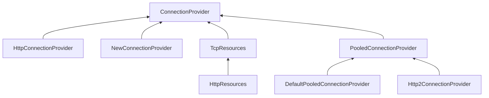

# Reactor Netty

资源池都在 HttpConnectionProvider。
支持 http1.0/1.1/2, 默认使用 http1.1 协议

继承关系如下:

ChannelFactory 似乎拥有一个 EventLoopGroup, 用来继续创建 Channel.

HttpClient 从 ConnectionProvider 获取一个 connection, 连接远程进行请求。所以怎么分配连接、管理链接 都是 ConnectionProvider 做的。

NewConnectionProvider 相对独立，每次都会新建一个，从这里入手了解似乎不错。

HttpResource 拥有三种资源

- LoopResources: 默认实现是 DefaultLoopResources, 通过 LoopResources.create 创建
- ConnectionProvider, 默认实现是 DefaultPooledConnectionProvider，通过 ConnectionProvider.create 创建
- AddressResorverGroup，DNS 模块，用来将 hostname 转化为 ip 地址 ?

所以 HttpResource::acquire 实际也是转发给了其他的 ConnectionProvider.

DefaultPooledConnectionProvider 内部利用了 PoolFactory

## 生产连接

NewConnectionProvider 是一个不错的开始，使用它每次请求都会创建一个新连接。

1. NewConnectionObserver, 创建好连接后，通过它初始化 sink。
2. ChannelInitializer，引用了 ConnectionObserver，用来初始化连接，
3. DisposableConnect, 如果连接创建失败，则把错误信息塞进 sink。

使用上面三个对象调用 `TransportConnector.connect`

- 从 config 中选取一个 eventloop
- doInitAndRegister 创建 channel 并进行初始化
- doConnect 连接 remoteAddr.
- defaultOnChannelInit 包括 proxy、HttpClientChannelInitializer
- TransportChannelInitializer::initChannel addReactiveBridge 会在channel bind 第一时间通知 ConnectionObserver
- HttpClientChannelInitializer 初始化，对于 Http1.1, 之后连接状态就不会再改变了，ConnectionObserver 的历史使命已经完成，对于 http2 来说，还有一个拥堵控制的状态变更。只考虑 http1.1 的逻辑会简单一些。
- HttpClientCodec ，请求编解码
